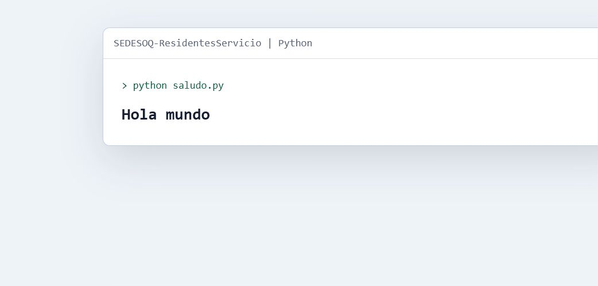

# SEDESOQ | Residentes y Servicio

Repositorio inicial de exploracion para propuestas relacionadas con residentes
y servicio social. Conserva planteamientos de posibles proyectos y una prueba
minima de ejecucion en Python.

## Preview



## Contenido actual

| Recurso | Descripcion |
| --- | --- |
| `Planteamientos.txt` | Ideas y lineas iniciales de trabajo |
| `saludo.py` | Prueba minima del entorno Python |
| `docs/` | Material visual de referencia |

## Estado

`Prototipo inicial / exploracion`

Este repositorio todavia no representa un sistema funcional ni un producto
desplegado. Su documentacion diferencia claramente el alcance actual de las
propuestas futuras.

## Ejecutar

```powershell
python saludo.py
```

Salida esperada:

```text
Hola mundo
```
